# Guided creation of Submodels via Semantic Models (Structured Concept Descriptions)

> **NOTE: The SAMM and SMT-attribute-set functionality and their corresponding extensions are in an experimental stage.**

## Table of Contents

- [Introduction](#introduction)
    - [Audience and Scope](#audience--scope)
    - [Terminology](#terminology)
- [AASX Package Explorer: Basics for Structured Concept Descriptions](#aasx-package-explorer-basics-for-structured-concept-decriptions)
	- [Dynamic Order for Concepts Descriptions](#dynamic-order-for-concept-descriptions)
	- [Guided Submodel (Instance) Creation](#guided-submodel-instance-creation)
- [Specifics SMT-attribute-set](#specifics-smt-attribute-set)
	- [Editing a SMT-attribute-set](#editing-a-smt-attribute-set)
- [Specifics Aspect Models](#specifics-aspect-models)
	- [Import and View an Aspect Model](#import-and-view-an-aspect-model)
	- [Creating a Submodel Instance guided by an Aspect Model](#creating-a-submodel-instance-guided-by-an-aspect-model)
	- [Editing an Aspect Model](#editing-an-aspect-model)
	- [Export Aspect Model](#export-aspect-model)
- [Background on Implementation](#background-on-implementation)
	- [Data Specifications and Extensions](#data-specifications-and-extensions)
	- [Structured Cocnept Description Extensions](#samm-extensions)
- [Annex](#annex)
	- [Aspect Models (SAMM) and ESMF](#aspect-models-samm-and-esmf)
		- [Semantic Aspect Meta Model](#semantic-aspect-meta-model)
		- [Eclipse Semantic Modeling Framework](#eclipse-semantic-modeling-framework)
		- [References for usage of SAMM and ESMF](#references)
		- [Examples](#examples)

## Introduction

### Audience and Scope

The scope of the document is to explain how to create a Submodel guided by a structured concept description using the [AASX Package Explorer](https://github.com/admin-shell-io/aasx-package-explorer).
Two different ways to do so are explored:

- via structured concept descriptions (SMT-attribute-set) using concept repository entries based on IEC61360 for its atomic properties (i.e. [Part 3a of the Specifications of the Asset Administration Shell](https://industrialdigitaltwin.org/en/content-hub/aasspecifications))
- via aspect models conformant to the [Semantic Aspect Meta Model (SAMM)](https://eclipse-esmf.github.io/samm-specification/2.1.0/index.html) 

Both are in experimental sate and are realized by using pre-defined [extensions](https://admin-shell.io/aas/3/0/Extension).

The umrella term "semantic model" is sometimes used to denote that there can be different ways to define a Concept Description for a Submobdel.

### Terminology

<a name="AAS">**Asset Administration Shell**</a>

> standardized [*digital representation*](#digital-representation) of an asset

Note 1 to entry: Asset Administration Shell and Administration Shell are
used synonymously.

*\[SOURCE: IEC 63278-1, note added\]*

<a name="submodel-template">**Submodel Template**</a>

> guides the creation of a [*Submodel*](#submodel) conformant
to the [*Aspect Model*](#aspect-model) and the [*Asset Administration Shell*](#asset-administration-shell).

*\[SOURCE: IEC 63278-1, extracted from text plus correlation with aspect model added \]*

<a name="digital-twin">**Digital Twin**</a>

> [*digital representation*](#digital-representation), sufficient to meet the requirements of a set of
use cases

Note 1 to entry: in this context, the entity in the definition of
digital representation is typically an asset.

*\[SOURCE: IIC Vocabulary IIC:IIVOC:V2.3:20201025, adapted (an asset,
process, or system was changed to an asset)\]*

<a name="digital-twin">**concept**</a>

> [*concept*](#concept), unit of knowledge created by a unique combination of characteristics

*\[SOURCE: IEC 61360-1:2017, 3.1.8\]*

<a name="digital-representation">**Digital representation**</a>

> information and services representing an entity from a given viewpoint

EXAMPLE 1: examples of information are properties (e.g., maximum
temperature), actual parameters (e.g., actual velocity), events (e.g.,
notification of status change), schematics (electrical), and
visualization information (2D and 3D drawings).

EXAMPLE 2: examples of services are providing the history of the
configuration data, providing the actual velocity, and providing a
simulation.

EXAMPLE 3: examples of viewpoints are mechanical, electrical, or
commercial characteristics.

*\[SOURCE: IEC 63278-1, editorial changes\]*

<a name="submodel">**Submodel**</a>

> container of [*SubmodelElement*](#submodel-element)s defining a hierarchical structure
consisting of SubmodelElements

*\[SOURCE: IEC 63278-1\]*

<a name="submodel-element">**SubmodelElement**</a>

> elements in a [*Submodel*](#submodel)

*\[SOURCE: IEC 63278-1\]*

<a name="submodel-template">**Submodel template**</a>

> container of Submodel template elements defining a hierarchical
structure consisting of Submodel template elements

*\[SOURCE: IEC 63278-1, note removed\]*

## AASX Package Explorer: Basics for Structured Concept Descriptions

### Dynamic Order for Concepts Descriptions

Every Concept Description is a stand-alone element and can be re-used because Concept Descriptions are identifiable, i.e. they have a unique ID.

It does not matter whether a concept description was created using the *SAMM extension* or the *SMT Attribute Set extension* or using the [standardized data specification IEC61360 (Part 3a)](https://industrialdigitaltwin.org/en/content-hub/aasspecifications): all Concept Descriptions are listed in all views.

A flat list of all available Concept Descriptions is shown via "Dynamic Order" = "List index" in the Concept Descriptions environmen (subsection "Dynamic rendering of ConceptDesriptions").

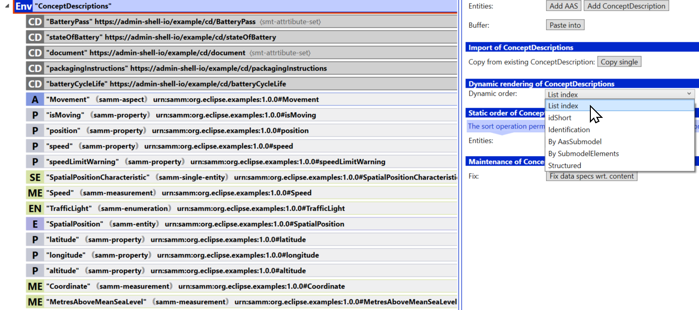

A more convenient view to see the structure of a Concept Description is the "Dynamic Order" set to "Structured". 

Please note that in the structured view elements that are used in several concept descriptions etc. are contained several times. However, in the model they only exist once.

Additionally, all concept descriptions are listed in the section "Unstructured ConceptDescriptions". Again, it does not matter whether a concept description was created using the standardized *data specification IEC61360*, or the *SAMM extension* or the *SMT Attribute Set extension*.

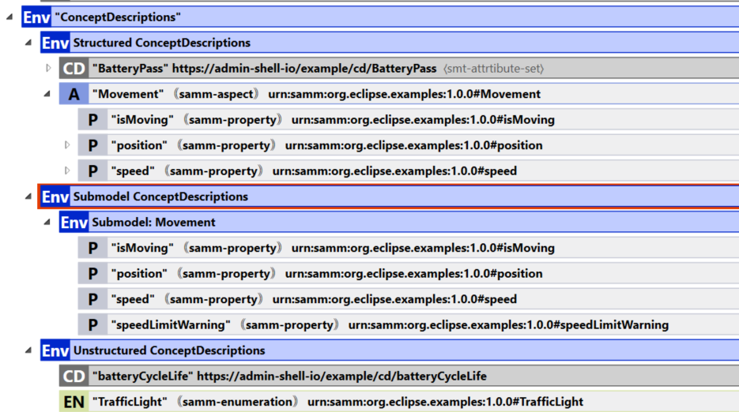

The section "Submodel ConceptDescription" shows which semantic IDs and thus Concept Descriptions are used within concrete Submodels. The example shows that additional properties, e.g. from the "Unstructured ConceptDescriptions" section can be added (here: "speedLimitWarning"). Since "speedLimitWarning" is now used within a Submodel it is not listed in the section "Unstructured ConcdeptDescriptions" any longer.

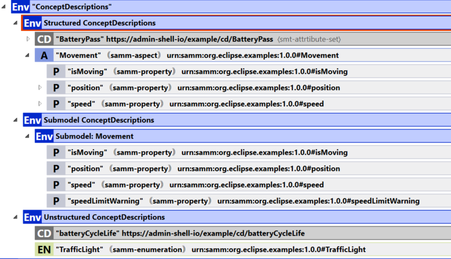

### Guided Submodel (Instance) Creation

The creation of a Submodel can be guided via existing structured Concept Descriptions. In the following the needed actions are described steps by step.

**Step 1: Create Asset Administration Shell**

**Step 2: Call "Workspace/Create.../New Submodel from SMT/SAMM ConceptDescription"**

**Step 3: Select Structured Concept Description that shall guide the creation of the Submodel from the existing set of Concept Description for Submodels**

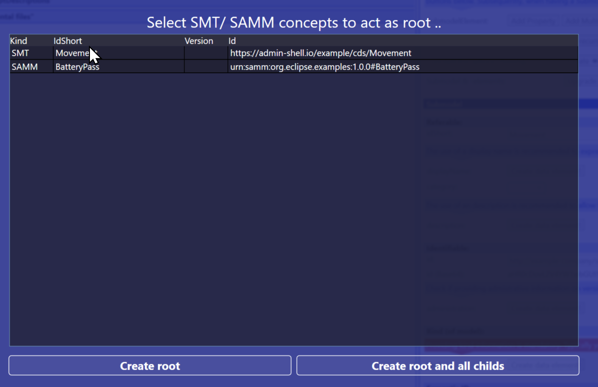

The attribute "kind" reflects whether the Concept Description available is based on the *SMT-attribute-set* or *SAMM *extension. Currently no other kinds of Concept Descriptions are available for Submodels.

**Step 4: Select "Create root" or "Create root and all childs"**

After selecting a submodel either all elements can be created at once including all optional elements ("Create root and all childs") or only the root ("Create root"). In the latter case the additional elements will be added one by one in a guided way. Only mandatory elements will be added at once.

The newly created submodel will have the ID of the selected semantic model as value of its semanticId (here the ID of the aspect model "Movement" with namespace "urn:samm:org.eclipse.examples:1.0.0#").

In the following we show the way when selecting the root only. 

In the next step an Administration Shell should be created that references the newly created Submodel. Otherwise it is not visible in the AASX Package Explorer which elements will be added to the created Submodel in the next steps.

**Step 5: Create Asset Administration Shell and reference the newly created Submodel**

After referencing the submodel that was created in the previous step the submodel is visible with its mandatory elements of the first level. There still might be mandatory elements on deeper levels.

In a next step new elements can be added in a guided way by choosing SubmodelElement -> "Add SMT guided ...". In our example this is only relevant for the SubmodelElementCollection "position". All other elements are atomic and there is not optional property on Submodel Level for Concept Description "Movement".

**Step 6: Use "Add SMT guided ..." to complete new Submodel and select needed elements. Repeat this steps as often as needed.**

The list of all allowed elements conformant to the aspect model/SMT selected in the previous step is shown. The "Card." shows whether the element is optional ("[0..1]") or mandatory ("[1]"). The "Type" column shows which kind of SubmodelElement will be created. In the example "latitude" will be mapped to a SubmodelElement "Property" abbreviated with "Prop". The abbreviations are used throughout the AASX Package Explorer but are also defined in [Specification of Asset Administration Shell, Part 1](https://industrialdigitaltwin.org/en/content-hub/aasspecifications).

Multi-Select is supported. It is strongley recommended to add all mandatory fields. The columns "Present" shows whether an element is already present ("1") (in this case do not add it twice) or not ("-").

Note: The AASX package explorer does not hinder to add fields several time or add additional properties not available in the aspect model. Validation will show whether the created submodel is valid and conformant to the semantic model selected.

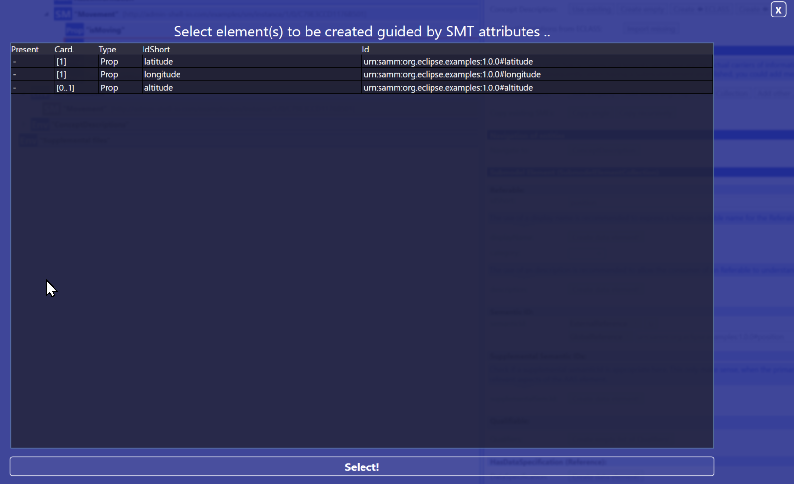

After selecting the elements (in our example only the mandatory fields were selected) they are created. As value the example value from the aspect model is inserted.

# Specifics SMT-attribute-set

## Editing a SMT-attribute-set

In this section we describe how to create and edit a Structured Concept Description using the *SMT-attribute-set extension*.

**Step 1: Add Concept Description**

**Step 2a: Add id and idShort of the newly defined Concept Description**

Add the definition of the concept in the languages you want to support.

**Step 2b: Add "description" as the definition of the concept**

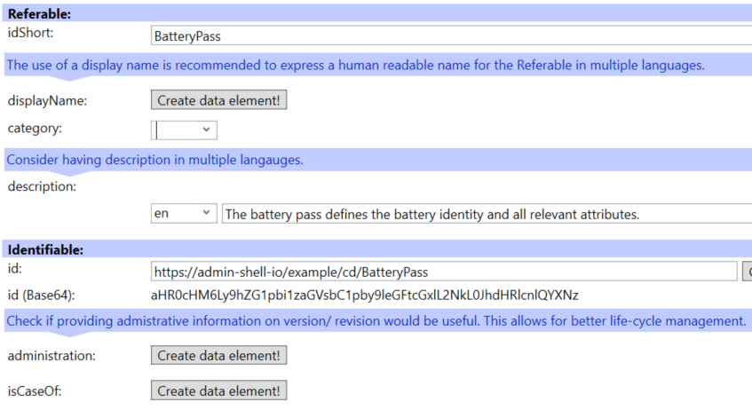

Note: In the  [data specification IEC61360](https://industrialdigitaltwin.org/en/content-hub/aasspecifications) the definition of the concept is not edited using the "description" attribute of the class [Referable](https://admin-shell.io/aas/3/0/Referable) but the attribute "definition" of the class [DataSpecificationIec61360](https://admin-shell.io/aas/3/0/DataSpecificationIec61360).

**Step 2c: If the structured Concept Description is derived from another concept definition then "isCaseOf" can be edited**

Example: A structured SMT-attribute-set may be derived from an [application class](https://eclass.eu/support/technical-specification/structure-and-elements/application-class) in [ECLASS](https://eclass.eu/).

**Step 3a: Open "Known extensions" by clicking on "Create data element!"**

**Step 3b: Choose known extension "SMT attributes"**

**Step 4: Edit extension for "SMT-attribute-set" **

There shall only be one SMT-attribute-set extension set per Concept Description. But other extensions can be added if supported.

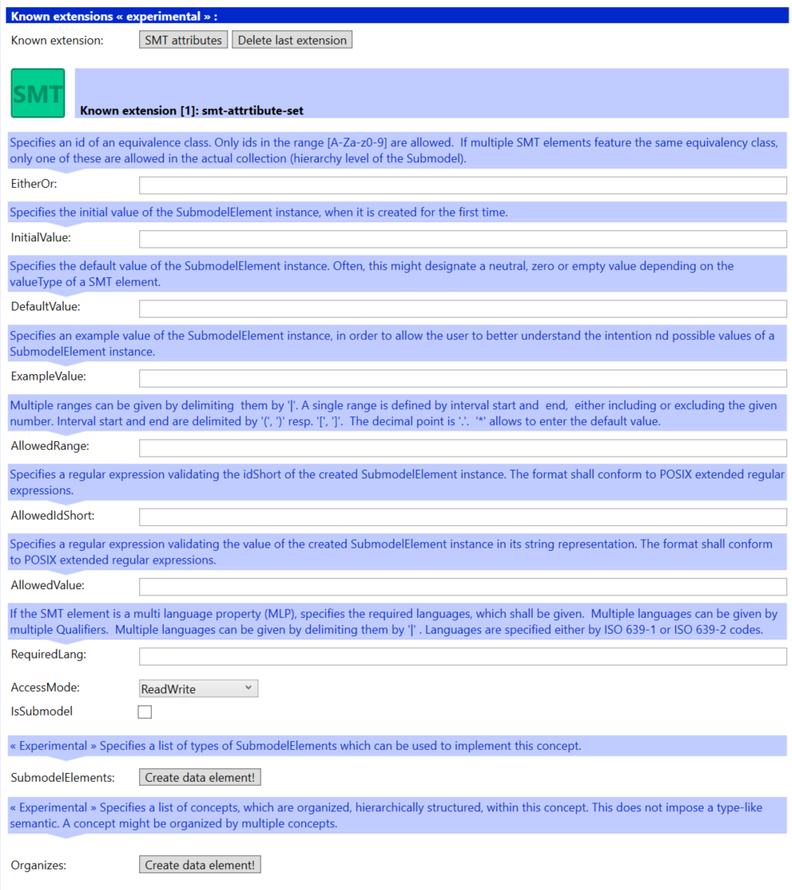

The fields available for the "SMT-attribute-set" are introduced in the [How to write a Submodel Template](https://industrialdigitaltwin.org/wp-content/uploads/2022/12/I40-IDTA-WS-Process-How-to-write-a-SMT-FINAL-.pdf) as qualifiers (see 
Table 6 – Qualifiers controlling the structure). 

One of these qualifiers enables to create a structured concept description, namely the "SMT/Cardinality" with its values "ZeroToOne", "One", "ZeroToMany" and "OneToMany". This is realized via the "organizes" feature. Add as many sub-SubmodelElements as needed via the "+" button and add the unique ID of the concept description of the sub-element.

**Step 5: If the structured Concept Description shall guide a Submodel creation set "isSubmodel" to 'True' by clicking the box**

**Step 6: Add IDs of concept descriptions of sub-elements to structured concept description via "Organizes"**

**Step 7: Select SubmodelElement that shall be used to implement concept**

There is a predefined list of possible SubmodelElements for implementation:

In case the SMT-attribute-set organizes another property either "SubmodelElementCollection" or "SubmodelElementList" should be selected. If several properties are organized then "SubmodelElementList" should be choosen.

After creation of the Concept Description follow the steps as described in section [AASX Package Explorer: Basics for Structured Concept Descriptions](#aasx-package-explorer-basics-for-structured-concept-decriptions) for creating a Submodel guided by this Concept Description and for getting an overview in the Concept Description section.

> If the sub-SubmodelElements are of type *Property* or *MultiLanguageProperty* then also IDs to elements defined using the [Data Specification IEC61360 (Part 3a of the Specification of the Asset Administration Shell)](https://industrialdigitaltwin.org/en/content-hub/aasspecifications)) can be used.

# Specifics Aspect Models

## Import and View an Aspect Model

Importing of existing aspect models is supported. 

**Step 1: Call use "File/Import .../Import SAMM aspect into ConceptDescriptions ..."**

Note: you should start with a new environment via "File/New ..." and switch to edit mode with"Workspace/Edit".

After import all elements of the aspect models are represented as concept description with their unique ID.

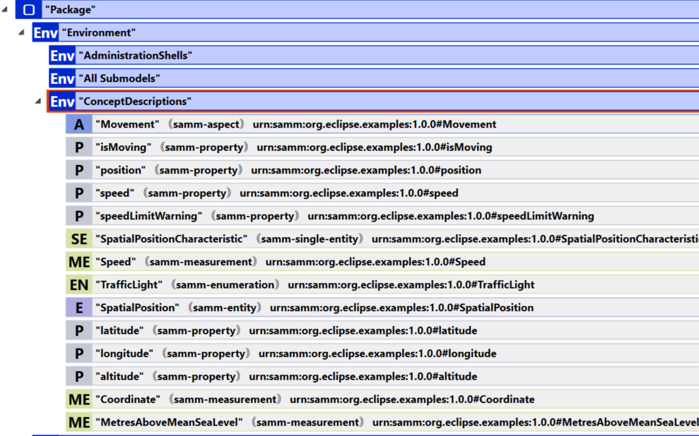

The coloring and naming of the different types of concept descriptions is aligend with the [ESMF Aspect Model Editor](https://eclipse-esmf.github.io/ame-guide/introduction.html).

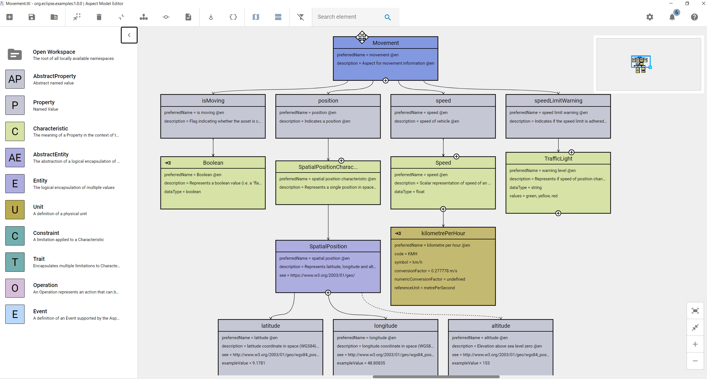

There are different views on the concept description supported by the AASX Package Explorer. For details see section  [Dynamic Order for Concepts Descriptions](#dynamic-order-for-concept-descriptions). The structured dynamic order gives the best overview. 

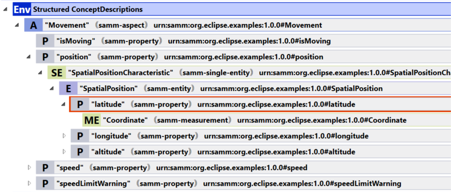

IN the following a subset of the most important abbreviations used is given:

<table>
  <thead>
    <tr>
      <th>Abbreviation</th>
      <th>SAMM Element</th>
      <th>kind of SAMM Element</th>
    </tr>
  </thead>
  <tbody>
    <tr>
      <td>A</td>
      <td>Aspect</td>
      <td></td>
    </tr>

    <tr>
      <td>C</td>
      <td>Characteristic</td>
      <td>Characteristic</td>
    </tr>

    <tr>
      <td>DU</td>
      <td>Duration</td>
      <td>Characteristic</td>
    </tr>

    <tr>
      <td>E</td>
      <td>Entity</td>
      <td></td>
    </tr>

    <tr>
      <td>EN</td>
      <td>Enumeration</td>
      <td>Characteristic</td>
    </tr>

    <tr>
      <td>ME</td>
      <td>Measurement</td>
      <td>Characteristic</td>
    </tr>

    <tr>
      <td>P</td>
      <td>Property</td>
      <td></td>
    </tr>

   <tr>
      <td>QN</td>
      <td>Quantifiable</td>
      <td>Characteristic</td>
    </tr>

    <tr>
      <td>SE</td>
      <td>SingleEntity</td>
      <td>Charateristic</td>
    </tr>

    <tr>
      <td>ST</td>
      <td>State</td>
      <td>Characteristic</td>
    </tr>

    <tr>
      <td>T</td>
      <td>Trait</td>
      <td></td>
    </tr>

  </tbody>
</table>

### Creating a Submodel Instance guided by an Aspect Model

It is possible to create a submodel based on an aspect model. Use "Workspace/Create .../New Submodel from SMT/SAMM Concept Description". Follow the steps as explained in section [Guided Submodel (Instance) Creation](#guided-submodel-instance-creation).

### Editing an Aspect Model

After adding a new Concept Description choose SAMM Extensions to model a new aspect model.

**Step 1) Add a new Concept Description**

First we add the *idShort* and *ID* of the Concept Description. These two attributes are not part of the SAMM extension but common to all Concept Descriptions.

**Step 2) Edit attribute "id" of the Concept Description (SAMM namespace+name)**

**Step 3) Edit attribute "idShort" of the Concept Description (SAMM name)**

The ID consists of the namespace and the name of the model element. In our example the namespace of the model is "urn:samm:org.eclipse.examples:1.0.0#" and its name is "Movement".

The *idShort* is the *name* of the SAMM element.

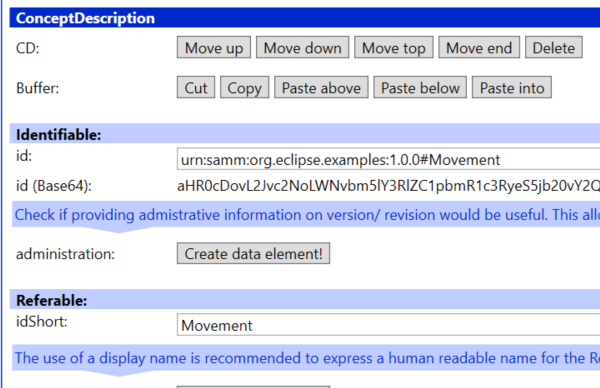

In a next step add the *preferredName* in the languages you want to support. In our example the preferred name is provided in English as "movement".

**Step 4a) Edit attribute "preferredName" of the SAMM Extension**

**Step 4b: Add "description" as the definition of the concept**

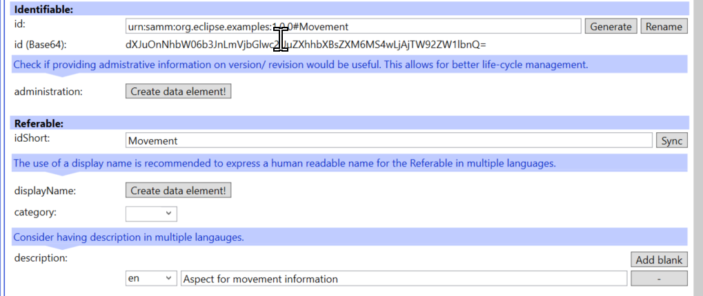

Note: In the  [data specification IEC61360](https://industrialdigitaltwin.org/en/content-hub/aasspecifications) the definition of the concept is not edited using the "description" attribute of the class [Referable](https://admin-shell.io/aas/3/0/Referable) but the attribute "definition" of the class [DataSpecificationIec61360](https://admin-shell.io/aas/3/0/DataSpecificationIec61360).

Now we start editing the SAMM extension itself.

**Step 5) Choose "SAMM Extensions:", click "Create data element!"**

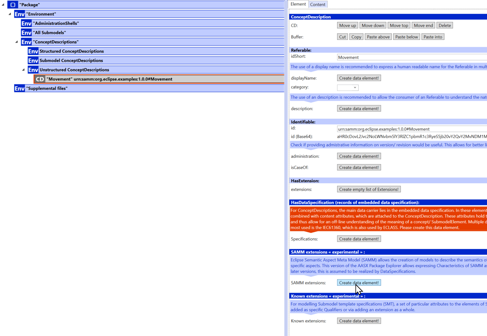

Clicking on "Add other" shows which SAMM element types are available to create and to edit.

**Step 6) Choose "Add other" for "Spec. records:"**

**Step 7a) Choose SAMM element type you want to add**

The list of SAMM element types contains not only all elements from the SAMM metamodel but also all predefined characteristics except for the basic ones like "bamm-c:Boolean" etc. because in this case the data type is added directly into the Concept Description and not into a new Concept Description.

*NOTE: per Concept Description please add only one SAMM Extension!*

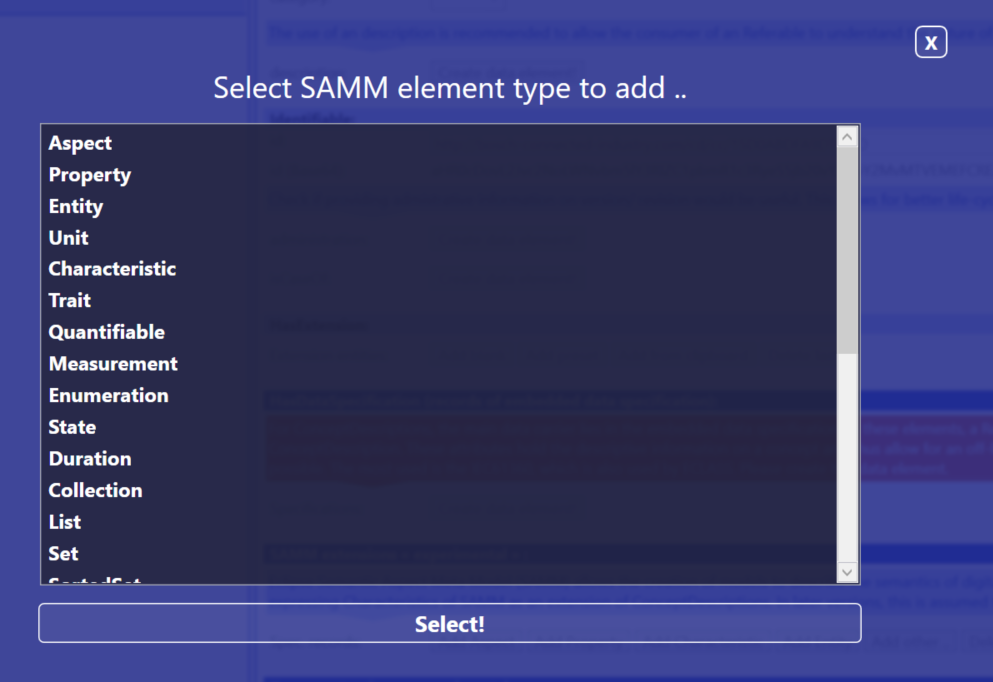

Click on the element you want to edit. In our example we start with modelling an aspect model "Movement", i.e. we choose "Aspect". Please note that after storing the icon used in the environment will change from "CD" to "A".

Note: depending on the element type choosen the attributes shown in the extension may differ conformant to the SAMM Metamodel definition.

This is an extract from the SAMM aspect modell Movement.ttl, the complete example can be found in the [Aspect Model Editor](https://github.com/eclipse-esmf/esmf-aspect-model-editor):

    @prefix samm: <urn:samm:org.eclipse.esmf.samm:meta-model:2.0.0#> .
	@prefix samm-c: <urn:samm:org.eclipse.esmf.samm:characteristic:2.0.0#> .
	@prefix samm-e: <urn:samm:org.eclipse.esmf.samm:entity:2.0.0#> .
	@prefix unit: <urn:samm:org.eclipse.esmf.samm:unit:2.0.0#> .
	@prefix rdf: <http://www.w3.org/1999/02/22-rdf-syntax-ns#> .
	@prefix rdfs: <http://www.w3.org/2000/01/rdf-schema#> .
	@prefix xsd: <http://www.w3.org/2001/XMLSchema#> .
	@prefix : <urn:samm:org.eclipse.examples:1.0.0#> .

	:Movement a samm:Aspect ;
	   samm:preferredName "movement"@en ;
	   samm:description "Aspect for movement information"@en ;
	   samm:properties ( :isMoving :position :speed :speedLimitWarning ) ;
	   samm:operations ( ) ;
	   samm:events ( ) .
	
	:isMoving a samm:Property ;
	   samm:preferredName "is moving"@en ;
	   samm:description "Flag indicating whether the asset is currently moving"@en ;
	   samm:characteristic samm-c:Boolean .
	
	:position a samm:Property ;
	   samm:preferredName "position"@en ;
	   samm:description "Indicates a position"@en ;
	   samm:characteristic :SpatialPositionCharacteristic .
	
		
	:SpatialPositionCharacteristic a samm-c:SingleEntity ;
	   samm:preferredName "spatial position characteristic"@en ;
	   samm:description "Represents a single position in space with optional z coordinate."@en ;
	   samm:dataType :SpatialPosition .
	

	:SpatialPosition a samm:Entity ;
	   samm:preferredName "spatial position"@en ;
	   samm:description "Represents latitude, longitude and altitude information in the WGS84 geodetic reference datum"@en ;
	   samm:see <https://www.w3.org/2003/01/geo/> ;
	   samm:properties ( :latitude :longitude [ samm:property :altitude; samm:optional true ] ) .
	
	:latitude a samm:Property ;
	   samm:preferredName "latitude"@en ;
	   samm:description "latitude coordinate in space (WGS84)"@en ;
	   samm:see <http://www.w3.org/2003/01/geo/wgs84_pos#lat> ;
	   samm:characteristic :Coordinate ;
	   samm:exampleValue "9.1781"^^xsd:decimal .
	
	:longitude a samm:Property ;
	   samm:preferredName "longitude"@en ;
	   samm:description "longitude coordinate in space (WGS84)"@en ;
	   samm:see <http://www.w3.org/2003/01/geo/wgs84_pos#long> ;
	   samm:characteristic :Coordinate ;
	   samm:exampleValue "48.80835"^^xsd:decimal .
	
	:altitude a samm:Property ;
	   samm:preferredName "altitude"@en ;
	   samm:description "Elevation above sea level zero"@en ;
	   samm:see <http://www.w3.org/2003/01/geo/wgs84_pos#alt> ;
	   samm:characteristic :MetresAboveMeanSeaLevel ;
	   samm:exampleValue "153"^^xsd:float .
	
	

Then select the version of the SAMM Aspect Metamodel that you need. In our example we select version 2.0.0.

**Step 7b) Choose Version of the SAMM Metamodel**

In a next step we add the properties "isMoving" and "position" to the aspect. This is done by clicking on the "+" button for "Properties".

The IDs of the two properties need to be added. Add as many properties as needed. If a property is optional click on the Box "Opt." In our example the two properties "isMoving" and "position" are mandatory.

**Step 8) (Context:Aspect or Entity) Add Properties with their unique ID**

**Step 9) (Context:Aspect or Entity) Decide whether Property is optional**

Now we need to add the two newly defined properties "isMoving" and "position". "isMoving" has the basic predefined Characteristic "samm-c:Boolean" with data type "Boolean". "position" has the Characteristic "samm-c:SingleEntity". The namespace of samm-c is *urn:samm:org.eclipse.examples:1.0.0#*.

**Step 10) (Context:Property) Edit attribute "Characteristic": Either select predefined characteristic or create new characteristic. If constraints shall be added to the characteristic a Trait needs to be created.**

We start Step 1) to Step 7) but this time choose the SAMM element type "Property". This Concept Description shall contain the information for the SAMM-property "isMoving". We select the predefined chacteristic "urn:samm:org.eclipse.esmf.samm:characteristic:2.0.0#Boolean" by selecting from the set of characteristics by clicking on "Preset".

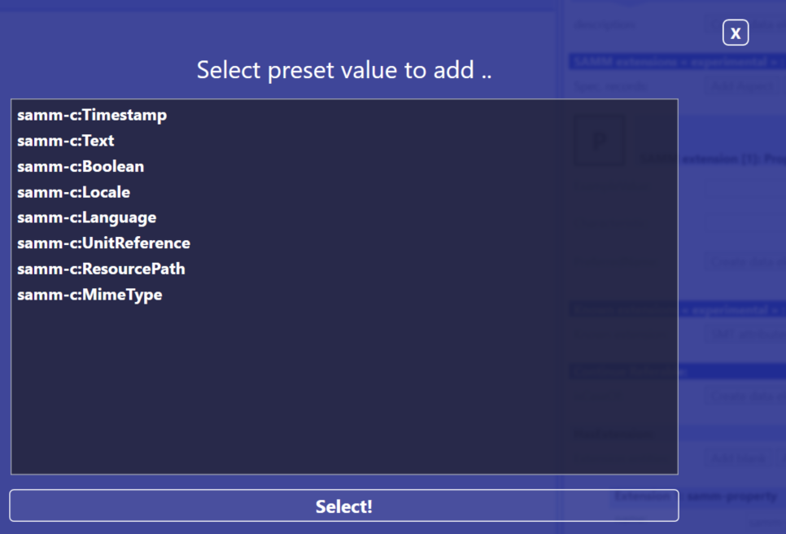

After is looks like this:

We start Step 1) to Step 7) again for the second "Property". This Concept Description shall contain the information for the SAMM-property "position". As value for the characteristic we add the characteristic "urn:samm:org.eclipse.examples:1.0.0#SpatialPositionCharacteristic". This is not a predefined characteristic in SAMM. This is why we need to add a new Concept Description representing the new characteristic "SpatialPositionCharacteristic" (following the steps 1) to Step 7)). As a SAMM model element type we choose "SingleEntity". As a data type we add "urn:samm:org.eclipse.examples:1.0.0#SpatialPosition".

For the SAMM-property "position" we create a new Concept Description of SAMM model element type "Entity" with ID "urn:samm:org.eclipse.examples:1.0.0#SpatialPosition", that is used as data type in the characteristic "SpatialPositionCharacteristic".

Important characteristics are the characteristics for sets, lists etc. For those the unique ID of the Element Characteristic needs to be added. A predefined characteristic may be used, see Step 10).

Traits are also supported. A Trait is a combination of a characteristic and a constraint. In this case an existing BaseCharacteristic and several constraints can be added. 

For each Constraint again a separate Concept Description of one of the SAMM model element types derined from "Constraint" needs to be created following steps 1) to 7). Choose one of the predefined constraint types like "RangeConstraint" etc.

**Step 11) (Context: Trait) Edit "BaseCharacteristic" and add IDs of cosntraints ("Constraint" and "+").**

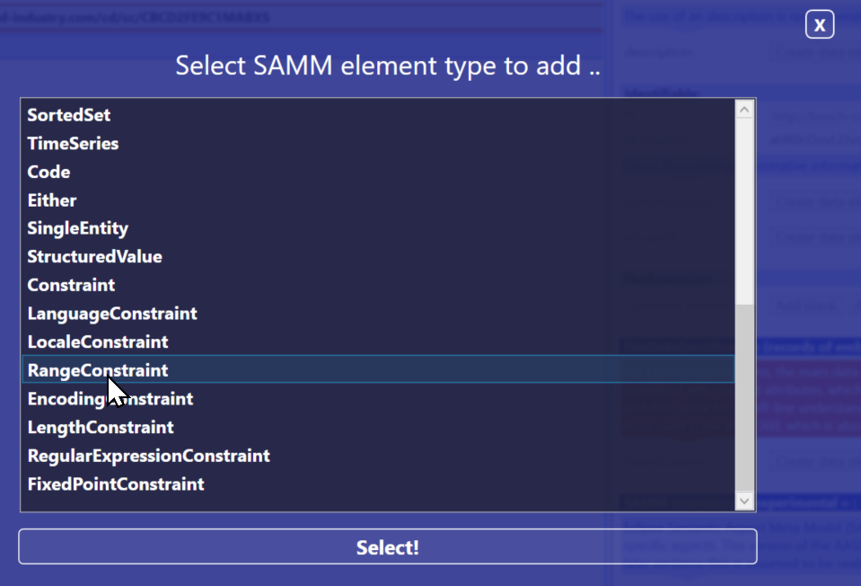

Note: It is not recommended to create a Concept Description for SAMM element type "Constraint" directly but for one of the [predefined constraint types](https://eclipse-esmf.github.io/samm-specification/snapshot/characteristics.html#constraints).

### Export Aspect Model

For exporting an aspect model from a choosen concept description use the "File/Export .../Export SAMM aspect model by selected CD". Before calling the export function you must select a concept description of type "samm-aspect".

# Background on Implementation

## Data Specifications and Extensions

The [Specification of the Asset Administration Shell](https://industrialdigitaltwin.org/en/content-hub/aasspecifications) support embedded data specifications. Data Specifications are supporting standardized extension points whereas Extensions are used for proprietary extensions (class "HasExtensions" in Part 1). All referables are allowed to have proprietary extensions.

Especially for concept descriptions it was foreseen that there will be different kinds of concept descriptions that need to be supported. In a first step a data specification for IEC61360 properties and values was standardized (Part 3a). These data specifications are embedded, i.e. they are part of the standardized schemas in https://github.com/admin-shell-io/aas-specs.

## SMT-attribute-set Extensions

Since there is no standardized data specification for structured concept descriptions so far the extension mechanism was used to implement the functionality as explained in this document.

The value of the Extension carries the attributes as well as the values of the attributes in a JSON format. This is why the "valueType" is "xs:string". In this example the attributes specific for a Submodel are shown. For details see section  [Specifics SMT-attribute-set](#specifics-smt-attribute-set).

      <conceptDescription>
      <extensions>
        <extension>
          <semanticId>
            <type>ExternalReference</type>
            <keys>
              <key>
                <type>GlobalReference</type>
                <value>https://admin-shell.io/SubmodelTemplates/smt-attribute-set/v1/0</value>
              </key>
            </keys>
          </semanticId>
          <name>smt-attrtibute-set</name>
          <valueType>xs:string</valueType>
          <value>{
  			"SmeCardinality": "One",
  			"EitherOr": "",
  			"InitialValue": "",
  			"DefaultValue": "",
  			ExampleValue": "",
  			"AllowedRange": "",
  			"AllowedIdShort": "",
  			"AllowedValue": "",
  			"RequiredLang": "",
  			"AccessMode": "ReadWrite",
  			"IsSubmodel": false,
  			"Organizes": [
			    {
			      "Cardinality": "One",
			      "Value": "https://admin-shell-io/example/cd/stateOfBattery"
			    },
			    {
			      "Cardinality": "One",
			      "Value": "https://admin-shell-io/example/cd/document"
			    }
  			]
		  }</value>
        </extension>
      </extensions>
      <idShort>BatteryPass</idShort>
      <id>https://admin-shell-io/example/cd/BatteryPass</id>
    </conceptDescription>

## SAMM Extensions

Since there is no standardized data specification for aspect models conformant to SAMM so far the extension mechanism was used to implement the functionality as explained in this document.

For details see [Specifics Aspect Models](#specifics-aspect-models).

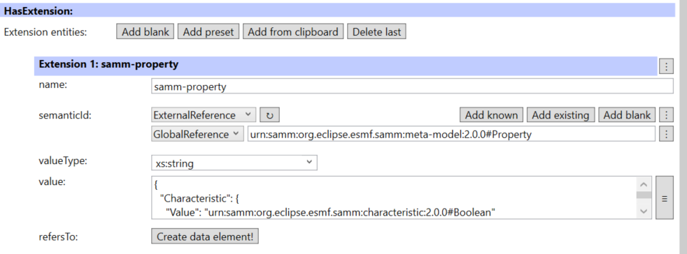

The semanticId of each extension corresponds to the SAMM Metamodel ID. For example the extension of a Concept Description representing a SAMM-property has the semantic ID *urn:samm:org.eclipse.esmf.samm:meta-model:2.0.0#Property*. The value of the Extension carries the attributes as well as the values of the attributes in a JSON format. This is why the "valueType" is "xs:string". In this example the attributes specific for a SAMM property are "Characteristic" and "PreferredName". 

    
    <extension>

      <semanticId>
        <type>ExternalReference</type>
        <keys>
          <key>
            <type>GlobalReference</type>
            <value>urn:samm:org.eclipse.esmf.samm:meta-model:2.0.0#Property</value>
          </key>
        </keys>
      </semanticId> 

      <name>samm-property</name>

      <valueType>xs:string</valueType>

      <value>{
        "Characteristic": {
          "Value": "urn:samm:org.eclipse.esmf.samm:characteristic:2.0.0#Boolean"
        },
        "PreferredName": [
        {
         "Language": "en",
         "Text": "is moving"
        }
       ]
      }</value>

    </extension>

The JSON value for an extension for a SAMM Measurement would look like this. It contains additionally a Unit ID.

      <value>{
        "Unit": {
          "Value": "urn:samm:org.eclipse.esmf.samm:unit:2.0.0#kilometrePerHour"
        },
       "DataType": {
          "Value": "http://www.w3.org/2001/XMLSchema#float"
       },
      "PreferredName": [
       {
         "Language": "en",
        "Text": "speed"
       }
      ]
    }</value>

# Annex

## SMT Attribute Sets 

### Mapping SMT-attribute-set to Submodel

In this section the mapping from the Concept Descriptions defined using the SMT-attribute-set extension when guiding the craation of a Submodel are described. The mapping strongly depends on SubmodelElements selected in "SubmodelElements".

<table>
  <thead>
    <tr>
      <th>SMT-attribute-set</th>
      <th>isSubmodel</th>
      <th>organizes</th>
      <th>SubmodelElement Selected</th>
      <th>Comment</th>
    </tr>
  </thead>
  <tbody>
    <tr>
      	<td>SMT-attribute-set</td>
      	<td>True</td>
      	<td></td>
      	<td>Submodel (SM)</td>
	<td>A Submodel should have at least one property organized</td>
    </tr>
    <tr>
      	<td>SMT-attribute-set</td>
      	<td>False</td>
      	<td>not empty, more than one property</td>
      	<td>Select SubmodelElementCollection</td>
	<td></td>
    </tr>
    <tr>
      	<td>SMT-attribute-set</td>
      	<td>False</td>
      	<td>not empty, but exactly one property</td>
      	<td>Select either SubmodelElementCollection or SubmodelElementList</td>
	<td></td>
    </tr>
    <tr>
      	<td>SMT-attribute-set</td>
      	<td>False</td>
      	<td>empty</td>
      	<td>Select any SubmodelElement type except SubmodelElementCollection or SubmodelElementList</td>
	<td>In case you are not yet finished with the definition via "organize" you may of course already select the target type</td>
    </tr>
  </tbody>
</table>

## Aspect Models (SAMM) and ESMF

### Eclipse Semantic Modeling Framework

The [Semantic Aspect Meta Model (SAMM)](https://github.com/eclipse-esmf/esmf-semantic-aspect-meta-model) is specified as an open standard
as integral part of the [Eclipse Semantic Modeling Framework (ESMF)](https://projects.eclipse.org/projects/dt.esmf).
This part again is part of the Top-Level Project [Eclipse Digital
Twin](ttps://projects.eclipse.org/projects/dt). The Eclipse Digital Twin Top-Level Project is a
collaborative, open-source initiative at the Eclipse Foundation
fostering the development of reference implementations for the
activities driven by the [Industrial Digital Twin
Association](https://industrialdigitaltwin.org) (IDTA).

The core of the Eclipse Semantic Modeling Framework is the development
of the Semantic Aspect Meta Model (SAMM). Besides the SAMM specifying
the language to define the semantics of a submodel in an ["Aspect
Model"](#aspect-model), the ESMF also includes an editor, SDKs in different programming
languages, a command line tool for validation, generating documentation
and different serializations and other functionality easing its usage
and implementation in digital twin projects. Also, aasx generators for
support of [Asset Administration Shell](#asset-administration-shell) are in scope.

Aspect Models express a schema with a defined Resource Description
Framework ([RDF](http://www.w3.org/TR/rdf11-concepts/)) vocabulary and are validated by a comprehensive
set of rules in the Shapes Constraint Language ([SHACL](https://www.w3.org/TR/shacl/)). Domain
semantics are captured by a combination of structural elements,
relations, namespaces and reified named concepts. 

The Eclipse Semantic Modeling Framework (ESMF) in combination with the
specifications of and open-source solutions for the Asset Administration
Shell accelerates the development of digital twin technologies and
drives its adoption in ecosystems.

### Semantic Aspect Meta Model (SAMM)

The [Semantic Aspect Meta Model (SAMM)](https://eclipse-esmf.github.io/samm-specification/2.1.0/index.html) provides a set of predefined
objects that allow a domain expert to define aspect models and

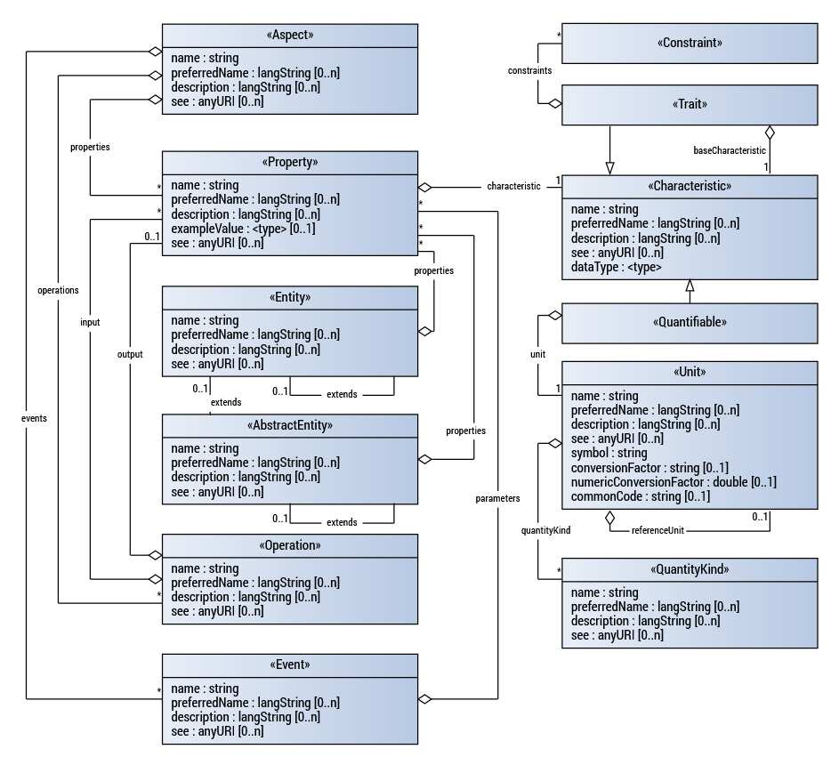

The complete specification and further information about its
implementation and requirements can be accessed via the [Eclipse Semantic Modeling Framework (ESMF)]([https://projects.eclipse.org/projects/dt.esmf](https://eclipse-esmf.github.io/samm-specification/snapshot/index.html)).

Every aspect model in
<https://github.com/eclipse-tractusx/sldt-semantic-models> that has
status "released" or "standardized" MUST be conformant to the
Semantic Aspect Meta Model.

Every new aspect model MUST be conformant to the version of the Semantic
Aspect Meta Model as noted in the [normative reference](#normative-references) [SAMM](#SAMM).

### References for usage of SAMM and ESMF

Semantic Models conformant to the Semantic Aspect Model Metamodel are defined and standardized in [Catena-X]{https://catena-x.net/en/}. These semantic models are available via the CC-BY-4.0 license in github:
<https://github.com/eclipse-tractusx/sldt-semantic-models>.

### Examples

An extract from a corresponding machine-readable specification of the
aspect model conformant to the Semantic Aspect Meta Model could look
like this:

	:Movement a samm:Aspect ;
	   samm:preferredName "movement"@en ;
	   samm:description "Aspect for movement information"@en ;
	   samm:properties ( :isMoving :position :speed :speedLimitWarning ) ;
	   samm:operations ( ) ;
	   samm:events ( ) .
	
	:isMoving a samm:Property ;
	   samm:preferredName "is moving"@en ;
	   samm:description "Flag indicating whether the asset is currently moving"@en ;
	   samm:characteristic samm-c:Boolean .

The [Movement.ttl](https://github.com/eclipse-esmf/esmf-aspect-model-editor/blob/main/core/apps/ame/src/assets/aspect-models/org.eclipse.examples/1.0.0/Movement.ttl) example in the "examples" folder is taken from the [Aspect Model Editor 5.0.0](https://github.com/eclipse-esmf/esmf-aspect-model-editor).

For more examples of aspect models conformant to the Semantic Aspect
Meta Model see for exampole those from Tractus-X: 
<https://github.com/eclipse-tractusx/sldt-semantic-models>.

### Mapping Aspect Model to Submodel

In this section the mapping from the Concept Descriptions defined for an aspect model when guiding the craation of a Submodel are described. The mapping strongly depends on the Characteristics used for the different elements.

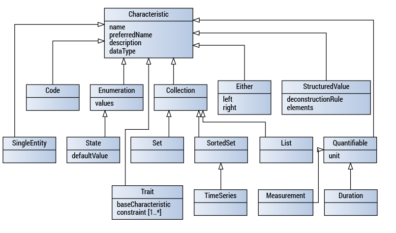

There are also predefined characteristic instances that may also result in different mappings.

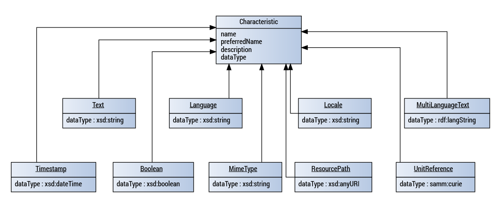

  

<table>
  <thead>
    <tr>
      <th>SAMM Element Type</th>
      <th>SAMM Characteristic or   Characteristic Instance</th>
      <th>SAMM Data Type</th>
      <th>AAS Submodel Element type</th>
      <th>Comment</th>
    </tr>
  </thead>
  <tbody>
    <tr>
      	<td>Aspect</td>
      	<td>--</td>
      	<td>--</td>
      	<td>Submodel (SM)</td>
		<td></td>
	</tr>
    <tr>
      	<td>Property</td>
      	<td></td>
      	<td>defined and scalar   but not rdf:langString</td>
      	<td>Property (Prop)</td>
		<td>Scalar Chacteristics: Quantifiable, StructuredValue, Boolean 
			  and subclasses like Measurement and Duration
           
        Allowed Characteristics that may be scalar (but also non-scalar, then they would have an "Entity" as dataType): Code, Enumeration   and subclasses like State
		    
		Scalar Characteristic Instances: Text, Timestamp, Boolean, MimeTye, ResourcePath, Locale, UnitReference </td>
    </tr>
    <tr>
      	<td>Property</td>
      	<td></td>
      	<td>rdf:langString</td>
      	<td>MultiLanguageProperty (MLP)</td>
		<td>The scalar Characteristic Instance "MultiLanguageText" is predefined for this purpose.</td>
    </tr>
    <tr>
      	<td>Property</td>
      	<td>SingleEntity</td>
      	<td>n/a</td>
      	<td>SubmodelElementCollection (SMC)</td>
		<td></td>
    </tr>
    <tr>
      	<td>Property</td>
		<td></td>
      	<td>defined and non-scalar
		  </td>
      	<td>SubmodelElementCollection (SMC)</td>
		<td>Allowed Characteristics that may be non-scalar: Code, Enumeration   and subclasses like State</td>
    </tr>
    <tr>
      	<td>Property</td>
      	<td>Collection</td>
      	<td>--</td>
      	<td>SubmodelElementList (SML)</td>
		<td>subclasses of Collection included: Set, SortedSet, TimeSeries, List</td>
    </tr>
    <tr>
      	<td>Property</td>
      	<td>Either</td>
      	<td>n/a</td>
      	<td>n/a</td>
		<td>Two elements will be created that both are optional.</td>
    </tr>
    <tr>
      	<td>Operation</td>
      	<td>n/a</td>
      	<td>n/a</td>
      	<td>Operation</td>
		<td></td>
    </tr>

  </tbody>
</table>

For mapping information see also mapping as implemented in the [CLI](https://github.com/eclipse-esmf/esmf-sdk/blob/main/documentation/developer-guide/modules/tooling-guide/pages/java-aspect-tooling.adoc#mapping-aspect-models-to-asset-administration-shell-aas-submodel-templates) of the ESMF project.
